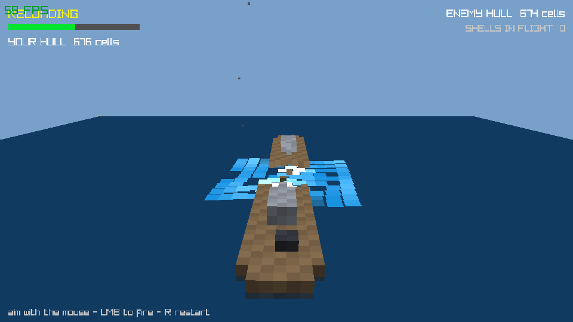

# naval-battle

Two voxel warships duel on a simulated particle ocean until one sinks. A
[Jolt](https://github.com/jolt-lang/jolt) (Clojure on Chez Scheme, no JVM)
prototype rendered with raylib and simulated with Box3D.



## What is simulated

- **Ocean** — a 2D vortex-particle field (ships shed vorticity, blasts inject
  swirl, spray particles get ballistic kicks). Velocity is evaluated per
  particle with a Greengard-style adaptive quadtree FMM; near-field pairs are
  summed directly, and the sea surface is lit per tile from the local height
  gradient with a sun, specular sparkle, and hull shadows.
- **Floatation** — buoyancy via the divergence theorem over each hull's
  water-plane-clipped surface mesh, so listing, flooding, and sinking emerge
  from the geometry rather than scripts.
- **Combat** — ballistic shells with an analytic firing solution preview arc,
  voxel-level hull carving on impact, flooding of carved cells, and debris.

## Requirements

- [jolt](https://github.com/jolt-lang/jolt) ≥ 0.8.1 (Homebrew: `brew install jolt`)
- A C toolchain (for the Box3D shim)
- raylib headers (the C shim links raylib; on macOS `brew install raylib`)

## Build and run

```
jolt native     # compile native/voxel_b3.c (the Box3D shim)
jolt -M:run     # play
jolt -M:test    # run the test suite
```

## Controls

- Move the mouse to aim; the dotted arc previews the shot
- Hold the left button to charge, release to fire (1.1 s for full power)
- `R` restarts after a battle ends

The enemy ship returns fire on its own.

## Code layout

- `src/voxel/world.clj` — game state machine: ships, shells, firing solution,
  impact handling, enemy AI
- `src/voxel/ocean.clj` — vortex-particle ocean and the FMM velocity solve
- `src/voxel/buoyancy.clj` — divergence-theorem buoyancy on clipped meshes
- `src/voxel/ship.clj` — the dreadnought voxel layout
- `src/voxel/mesh.clj` — voxel surface extraction
- `src/voxel/physics.clj` — Box3D bodies, floatation forces, damage
- `src/voxel/box3d.clj` — FFI bindings to the Box3D shim
- `src/voxel/render.clj` — scene drawing, ocean lighting and shading
- `src/voxel/raylib.clj` — raylib FFI, immediate-mode draw helpers
- `src/voxel/input.clj` — mouse/keyboard snapshot, sea-plane picking
- `src/voxel/main.clj` — window, game loop

Pure logic (world/ocean/buoyancy/mesh/ship) is headless and unit-tested;
only physics/render/main/box3d touch I/O.

## Smoke testing headlessly

```
env RAYLIB_APP_AUTO_QUIT_MS=45000 VOXEL_APP_AUTOFIRE=90 RAYLIB_APP_SHOT=shot.png jolt -M:run
```

runs a fixed 45 s match with autofiring guns, saves `shot.png`, and prints a
frame/battle summary.

Status: prototype — playable end to end, art direction still rough.
